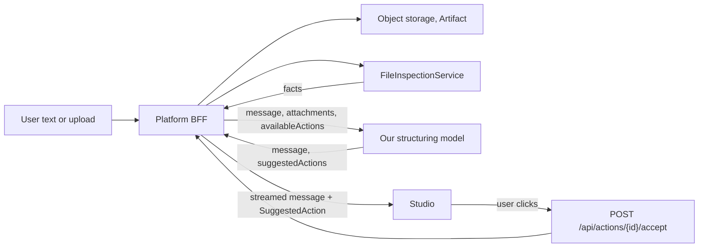

# Model integration

How chat and file understanding move off Anthropic and onto our own structuring model behind the Platform BFF. The rule that keeps the seams greppable is [.cursor/rules/waiting-model.mdc](../.cursor/rules/waiting-model.mdc); this document is the contract behind it.

Source of truth: [hackaton26-plans](https://github.com/bauzwilling/hackaton26-plans) — `master-plan/boundary-plan.md`, `master-plan/delivery-manifest.md`, `msd-concierge-ui/README.md`.

## The boundary

> AI proposes. The BFF owns truth. Adapters translate. Services execute.

- The UI talks only to the BFF. Never to an AI provider, Door Box-Out, Simple Parts, Worklist or Rhino Compute.
- The AI understands, explains and suggests. It starts nothing, writes no state and is never trusted for IDs.
- Quick AI (chat, file explanation, next step, error explanation) streams over SSE and the connection lasts only for the reply. Genuinely heavy AI is `POST /api/chats/{chatId}/ai-operations` → `202` + `operationId` → poll. Never hold a request open waiting for manufacturing.
- File understanding is two jobs, not one. The BFF's deterministic `FileInspectionService` extracts facts; the model reasons over those facts plus the available actions. The UI does neither.



## What stands in today

| Stand-in | What it fakes | What replaces it |
| --- | --- | --- |
| [server.py](../server.py) + [llm.py](../llm.py) | the whole chat backend; calls Anthropic `claude-sonnet-4-5` directly | the BFF chat endpoints. Delete both files, do not port them |
| [app/src/lib/concierge.ts](../app/src/lib/concierge.ts) | `POST /api/chat` → `{ reply, app }` | `POST /api/chats/{chatId}/messages/stream` consumed as SSE, plus BFF-owned actions |
| `classifyFile()` in [app/src/lib/intake.ts](../app/src/lib/intake.ts) | the model reading a file: `keywordApp()` regexes on the file name, then a `defaultApp(format)` table | upload → artifact → inspector facts → model proposal |
| `formatOf()` / `MIME_TO_FORMAT` in the same file | the inspector's deterministic detection | `FileInspectionService`, reported back as `detectedType` + `facts` |
| `openingMessage()` and `CONFIRM_MESSAGE` | the model's wording | the model's `message` |
| `confirmApps` in `ingestFiles`, [app/src/context/workspace.tsx](../app/src/context/workspace.tsx) | an ambiguous result offering three apps | several `SuggestedAction`s the user picks from |
| `settle()` in the same file | a reply that opens a window on its own | render the action, open nothing until `accept` returns |
| [app/src/lib/routing.ts](../app/src/lib/routing.ts) | last-resort name match when the assistant is unreachable | stays, but the fallback buttons hit the BFF (delivery-manifest §32) |

`grep -rn "WAITING MODEL"` finds each site in code.

## Target contracts

Upload. Binaries go UI → BFF → object storage; the UI holds artifact IDs, never bytes.

```http
POST /api/chats/{chatId}/attachments
GET  /api/artifacts/{artifactId}
```

The inspector result the BFF stores on `Artifact.MetadataJson` and hands to the model:

```json
{
  "artifactId": "ART-100",
  "fileName": "panels.3dm",
  "detectedType": "geometry",
  "format": "3dm",
  "facts": { "brepCount": 42, "objectCount": 42 },
  "supportedActions": ["mill"]
}
```

Message. Attachments are referenced by ID:

```http
POST /api/chats/{chatId}/messages/stream
GET  /api/chats/{chatId}/messages
```

```json
{ "content": "Prepare this for milling", "attachmentIds": ["ART-100"] }
```

What our model receives and returns (BFF-internal, but it shapes what the UI can show):

```json
{
  "userMessage": "Mill these parts",
  "attachments": [{ "artifactId": "ART-100", "type": "input.geometry", "fileName": "panels.3dm", "facts": { "brepCount": 42 } }],
  "context": { "activeRuns": [], "availableCapabilities": ["design.doorboxout", "mill", "produce"] }
}
```

```json
{
  "message": "I found an existing geometry file. It can be sent directly to Mill.",
  "suggestedActions": [{ "type": "mill.start", "label": "Mill this design", "inputArtifactIds": ["ART-100"] }]
}
```

What the UI actually renders — normalized, BFF-owned, not legacy app ids:

```json
{ "actionId": "ACT-551", "type": "mill.start", "label": "Mill this design" }
```

```http
POST /api/actions/{actionId}/accept
POST /api/actions/{actionId}/dismiss
```

The BFF revalidates on accept. Only then does anything run.

## What this means for UI/UX now

Build the Studio so these swaps are edits, not rewrites.

- **A drop is an attachment, not a route.** Uploading produces an attachment chip and an artifact ID. Any window that opens is the consequence of an action, so do not couple the drop handler to `openApp`.
- **Understanding is asynchronous.** `classifyFile()` answers instantly and synchronously; the real path is upload, inspect, then stream. Every intake surface needs pending, empty and failed states, and the request log entry must be able to sit in `pending` for a while.
- **Proposals are buttons, not auto-opens.** Every route the concierge can take must survive becoming a button the user clicks. Treat `confirmApps` as the general case (a list of proposals) rather than a special ambiguity branch.
- **Actions are typed, not app ids.** `type` is `mill.start`, not `simpleparts`. Keep the mapping from action type to window in one place so it can be swapped for a BFF capability manifest.
- **Copy comes from the model.** Do not add new hard-coded assistant sentences outside `intake.ts`; they all have to be deleted later.
- **AI down must stay usable.** The fallback offers plain capability buttons and those still go to the BFF. Manufacturing works without AI.
- **Never show internal IDs.** No `SimplePartsJobId`, Grasshopper job or Worklist upload ID reaches the UI.

## Cutover checklist

1. `POST /api/chats/{chatId}/attachments` exists → move `ingestFiles` to upload-first, drop `keywordApp`/`defaultApp`.
2. Inspector facts available → delete `formatOf` and `MIME_TO_FORMAT`, keep `FILE_ACCEPT` only as a client-side hint.
3. SSE messages endpoint exists → rewrite `askConcierge` inside [app/src/lib/concierge.ts](../app/src/lib/concierge.ts) only; callers keep the same function.
4. `SuggestedAction` exists → replace the `appId` branch in `settle()` and the `confirmApps` branch with action rendering plus accept/dismiss.
5. Model reachable through the BFF → delete `server.py`, `llm.py`, `prompts/`, the `/api` Vite proxy rule and `ANTHROPIC_API_KEY` from the app's runtime.
6. Chat persistence exists → the request log stops being the conversation store (that part is `WAITING DATABASE`).
7. Verify nothing is left:

```bash
grep -rn "WAITING MODEL" .
grep -rn "WAITING BFF" .
grep -rn "WAITING DATABASE" .
```
